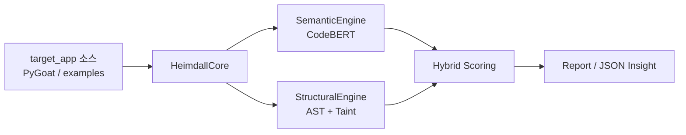

# Heimdall (헤임달)

**Hybrid Threat Analysis Engine for Vulnerable Application Assessment**

Python 기반 보안 엔지니어링 도구로, **OWASP PyGoat** 등 모의 취약 애플리케이션(`target_app`)의 소스 코드를 대상으로 **자동 보안 진단·위협 근거 추출·AI 보조 검증**을 수행합니다.  
단순 시그니처 매칭을 넘어, **코드의 의도(Semantic)** 와 **데이터 흐름(Structural)** 을 동시에 분석해 재현 가능한 인사이트를 제공합니다.

> *"단순한 패턴 매칭을 넘어, 코드의 의도와 논리를 동시에 꿰뚫어 본다."*

---

## 📌 Project Overview

| 항목 | 설명 |
|------|------|
| **목적** | 취약점 연습/모의 타겟 앱의 Python 코드에서 Command Injection, Code Execution, SSRF 등 위협 시나리오를 자동 탐지 |
| **대상** | `target_app` (예: 로컬에 배치한 **PyGoat** `introduction/views.py` 등 Django/Flask 뷰 코드) |
| **출력** | 사람이 읽는 **Heimdall Report** + 파이프라인 연동용 **JSON (`HybridResult`)** |
| **핵심 가치** | TIP(Threat Intelligence Platform) 운영 관점의 **시나리오 자동화 · 정형화 · AI 교차 검증** 워크플로를 코드 레벨에서 구현 |

### 분석 파이프라인 (요약)



---

## 🛠️ Key Features & Architecture

### 직무 요구사항 ↔ Heimdall 기능 매핑

| TIP Ops 핵심 역량 | Heimdall 구현 | 대응 모듈 |
|-------------------|---------------|-----------|
| **① TIP 테스트 시나리오 자동화** | Sink/Source 규칙 기반 **자동 스캔**, `examples/` 벤치마크 시나리오, CLI 일괄 분석 | `structural.py`, `scripts/analyze.py`, `examples/` |
| **② 수집 데이터 규격화 & Insight 추출** | 탐지 결과를 **dataclass 스키마**로 정형화, Source→Sink **경로(path)**·심각도·룰 ID 포함 JSON/리포트 출력 | `types.py`, `report.py`, `--json` |
| **③ AI 결과물 검증 & 프롬프트(모델) 개선** | CodeBERT **Semantic** 점수와 AST **Structural** 증거를 **하이브리드 결합**, 신호 불일치 시 `notes`로 오탐/미탐 힌트 제공 | `semantic.py`, `core.py`, `utils/scoring.py` |

---

### ① TIP 테스트 시나리오 자동화

- **규칙 기반 탐지 엔진**: `DEFAULT_SINKS` (eval/exec, `os.system`, subprocess, pickle, SQL execute 등) 및 `TAINT_SOURCES` (input, `request.POST`/`GET`/`FILES`, Django `request` 계열) 정의
- **자동 실행 CLI**: 단일 명령으로 타겟 파일 분석

```powershell
$env:PYTHONPATH="src"
.\.venv\Scripts\python .\scripts\analyze.py --file .\path\to\target_app\views.py
```

- **회귀 시나리오 세트**: `examples/` 디렉터리에 Sanitizer, Field-sensitive dict, Interprocedural, Dead Code 등 **의도적으로 설계된 테스트 케이스** 포함

---

### ② 수집 데이터 규격화 및 Insight/요약 추출

분석 결과는 일관된 스키마로 직렬화됩니다.

| 타입 | 필드 (요약) |
|------|-------------|
| `StructuralFinding` | `rule_id`, `title`, `severity`, `lineno`, `message`, `extra.paths` (Source→Sink 경로) |
| `SemanticResult` | `score`, `top_anchor`, `similarities`, `model_name` |
| `HybridResult` | `risk_index`, `semantic`, `structural`, `weights`, `notes` |

- **Human-readable**: `format_report()` — Risk Index 바, Finding 목록, **Path 증거** (`source:input -> assign -> call -> sink`)
- **Machine-readable**: `--json --pretty` — SIEM/TIP 파이프라인·대시보드 연동을 위한 정형 출력

```powershell
.\.venv\Scripts\python .\scripts\analyze.py --file .\examples\grand_final.py --json --pretty
```

> **Note:** 현재 버전은 **애플리케이션 소스/로직 기반** 위협 인텔리전스에 최적화되어 있습니다. HTTP 패킷 캡처 파서는 확장 포인트로, 동일 JSON 스키마에 외부 로그 소스를 매핑할 수 있습니다.

---

### ③ AI 결과물 검증 및 프롬프트(모델) 개선

| 레이어 | 역할 | 검증 관점 |
|--------|------|-----------|
| **SemanticEngine** | CodeBERT 임베딩 + 위협 **Anchor** 유사도 | “이 코드가 어떤 공격 시나리오에 **문맥적으로** 가까운가?” |
| **StructuralEngine** | AST + **Interprocedural Taint** + Sanitizer + DCE | “실제로 **Source→Sink 경로**가 존재하는가?” (증거 기반) |
| **HeimdallCore** | `hybrid_risk()` 가중 결합 + **교차 검증 notes** | Semantic↑ Structural↓ → 오탐 가능성 힌트 등 |

- AI 단독 신뢰 금지: Structural **finding + path** 없이 Semantic만 높은 경우, 리포트 `notes`에 불일치 경고
- Anchor 세트(`DEFAULT_ANCHORS`)는 위협 유형별로 확장·튜닝 가능 (프롬프트/시나리오 개선에 대응)

---

### Structural Engine — 기술 하이라이트

| 기능 | 설명 |
|------|------|
| **Interprocedural Taint** | 함수 요약(Fixpoint) + 호출 경계를 넘는 Source→Sink 추적 |
| **Field-sensitive Dict** | `data['poison']` / `data['safe']` 키 단위 오염 분리 |
| **Sanitizer** | `html.escape`, `str.replace`, `int()` 등 SAFE_FUNCTIONS 통과 시 untaint |
| **Dead Code Elimination** | `if False`, `if 1 == 0`, `ast.literal_eval` 기반 상수 조건 분기 스킵 |
| **Django Sources** | `request.POST.get`, `request.GET['key']`, `request.body` 등 패턴 지원 |

---

## 📂 Directory Structure

```
Heimdall/
├── src/heimdall/                 # 핵심 패키지
│   ├── core.py                   # HeimdallCore — 오케스트레이터 (Hybrid 결합)
│   ├── types.py                  # HybridResult / Finding 스키마 (정형화)
│   ├── report.py                 # Human-readable 리포트 포맷터
│   ├── engines/
│   │   ├── structural.py         # ★ AST + Taint + Sink/Source 규칙 엔진
│   │   └── semantic.py           # ★ CodeBERT Semantic 엔진
│   └── utils/
│       ├── scoring.py            # hybrid_risk() 점수 결합
│       └── logging.py
├── scripts/
│   ├── analyze.py                # ★ CLI 진입점 (파일 분석 / JSON 출력)
│   └── scan_secrets.py           # ★ 하드코딩 비밀 스캔 (공개 전 무결성 검증)
├── examples/                     # 회귀·데모 시나리오 (합성 취약 코드)
│   ├── challenge.py
│   ├── final_boss.py
│   ├── grand_final.py
│   └── ultimate_stress_test.py
├── data/                         # (확장) 코퍼스·벤치마크·로그 아카이브
├── models/                       # (확장) fine-tuned 체크포인트
├── .env.example                  # 환경변수 템플릿 (비밀값 없음)
├── SECURITY.md                   # 시크릿·PyGoat 제외 가이드
├── pyproject.toml
└── requirements.txt
```

### 면접관이 먼저 보면 좋은 파일 (Recommended Reading Order)

1. `src/heimdall/engines/structural.py` — Taint/Sink/Source/DCE 핵심 로직  
2. `src/heimdall/core.py` — Dual-engine 오케스트레이션  
3. `src/heimdall/types.py` + `report.py` — 정형 출력·인사이트 포맷  
4. `scripts/analyze.py` — 실행 진입점  
5. `examples/grand_final.py` — End-to-end 시나리오 (Sanitizer + Interprocedural + DCE)

---

## 🚀 Quick Start

### 1. 환경 구성

```powershell
python -m venv .venv
.\.venv\Scripts\activate
pip install -r requirements.txt
```

선택: Hugging Face 모델 다운로드 rate limit 완화

```powershell
copy .env.example .env
# .env 에 HF_TOKEN=hf_... 설정 (선택)
```

### 2. 합성 시나리오 분석 (레포 내장)

```powershell
$env:PYTHONPATH="src"
.\.venv\Scripts\python .\scripts\analyze.py --file .\examples\grand_final.py
```

### 3. PyGoat 등 `target_app` 분석 (로컬 배치)

PyGoat는 **의도적 취약점**이 포함된 외부 OSS이므로, 본 레포에는 포함하지 않습니다 (`.gitignore` 참고).  
로컬에 클론한 뒤 경로만 지정해 분석합니다.

```powershell
.\.venv\Scripts\python .\scripts\analyze.py --file C:\path\to\pygoat\introduction\views.py --json --pretty
```

### 4. 벤치마크 시나리오 (examples)

| 파일 | 검증 포인트 |
|------|-------------|
| `challenge.py` | Sanitizer, dict field-sensitivity, dead code |
| `final_boss.py` | Interprocedural + `poison` 키만 탐지 |
| `grand_final.py` | 다단 함수 전파 + `if 2+2==5` DCE |
| `ultimate_stress_test.py` | Alias, reassignment, 복합 구조 |

---

## 🔒 Security & Clean Code

보안 직무 지원자로서 **공개 저장소 무결성**을 전제로 설계했습니다.

| 항목 | 상태 |
|------|------|
| 하드코딩 API Key / Token / Password | **없음** (자동 스캔 `TOTAL 0` 확인) |
| 비밀값 관리 | `.env` + `.env.example` 템플릿 (실제 `.env`는 `.gitignore`) |
| 공개 전 검증 | `scripts/scan_secrets.py` (`--exclude pygoat` 지원) |
| 외부 취약 앱 | `pygoat/` 커밋 제외 — 분석 대상으로만 사용 |

```powershell
.\.venv\Scripts\python .\scripts\scan_secrets.py
.\.venv\Scripts\python .\scripts\scan_secrets.py --exclude pygoat
```

자세한 정책: [SECURITY.md](SECURITY.md)

---

## 🧰 Tech Stack

| 영역 | 기술 |
|------|------|
| Language | Python 3.10+ |
| Semantic | PyTorch, Hugging Face `transformers` (CodeBERT) |
| Structural | `ast`, Interprocedural Taint, constant folding (`literal_eval`) |
| Output | `dataclasses`, JSON, Markdown-style Report |

---

## 📈 Roadmap (TIP Ops 확장)

- [ ] `target_app` 디렉터리 일괄 스캔 (`analyze --root`)
- [ ] HTTP/공격 로그 → `HybridResult` 매핑 어댑터
- [ ] PyGoat 챕터별 TIP 시나리오 매핑 테이블
- [ ] Semantic Anchor fine-tuning 및 FP/FN 메트릭 대시보드

---

## 📄 License & Disclaimer

- `examples/` 및 분석 대상 **PyGoat** 코드는 **교육·연구 목적**의 취약 패턴 재현용입니다.
- Heimdall은 **방어·진단 보조** 도구이며, 무단 침해 테스트에 사용해서는 안 됩니다.

---

## Author

**Threat Intelligence / Security Engineering Portfolio**  
문의 및 피드백은 Issues 또는 Pull Request로 환영합니다.
